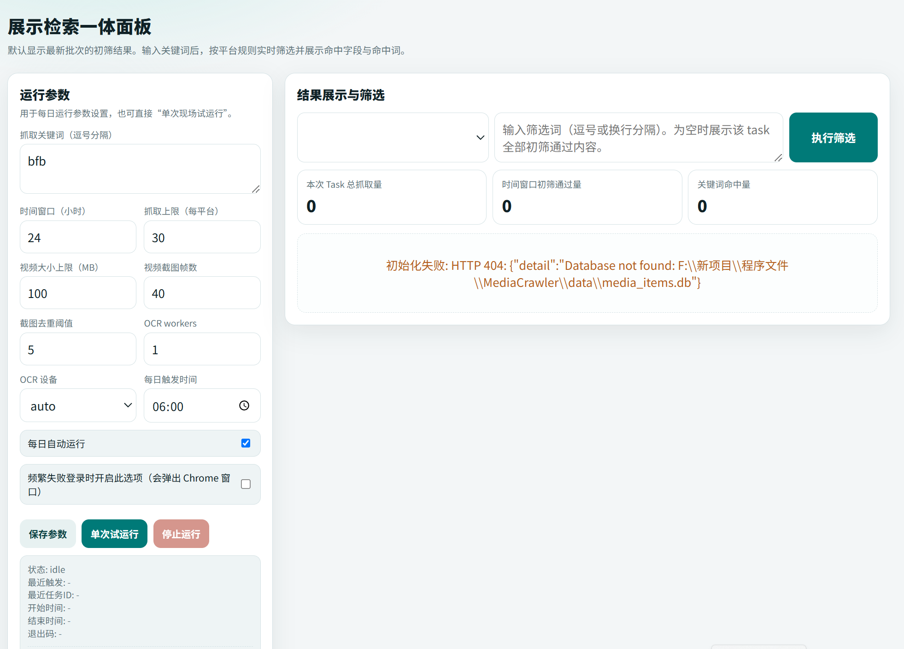

# 社媒筛选器

一个面向 Windows 的本地工具，用于抓取社媒内容、提取截图与 OCR 文字，并在展示页面中进行检索与筛选。

## 界面预览

## 主要功能

- 支持小红书、B 站等平台的内容抓取
- 支持视频截图与图片文字 OCR 提取
- 支持本地展示页面检索、筛选与查看详情
- 提供面向普通用户的安装引导和启动入口

## 适用范围

- 当前以 Windows 环境为主
- 当前仓库主要用于学习、研究、分享和版本管理
- 普通用户建议使用打包后的程序，不直接运行源码

## 普通用户使用方式

首次使用：

1. 运行 `运行前安装向导.exe`
2. 按提示完成环境安装
3. 登录小红书和 B 站账号

日常使用：

1. 运行 `开始运行.exe`
2. 浏览器会自动打开本地展示页面
3. 在页面中执行检索、单次运行和结果查看

## 开发目录说明

- `DashboardQuerying/`：展示检索服务与前端页面
- `MediaCrawler/`：社媒抓取相关逻辑
- `VideoScreenshotter/`：视频截图处理
- `PaddleOCRProcessor/`：OCR 文字提取
- `Launcher/`：绿色版启动器与安装引导

## 本地开发运行

1. 准备 Python 环境
2. 安装 `requirements_all.txt` 中的依赖
3. 启动 `DashboardQuerying/app.py`

## 第三方项目说明

本项目使用了第三方项目或第三方依赖，主要包括以下两部分：

### 1. MediaCrawler

- 本仓库内包含 `MediaCrawler/` 目录
- 该目录来源于第三方项目，并已根据本项目需求进行了本地修改
- 上游项目地址：<https://github.com/NanmiCoder/MediaCrawler>
- 本地许可证文件位置：`MediaCrawler/LICENSE`

请特别注意：

- `MediaCrawler` 当前采用的不是常见的宽松开源许可证
- 其许可证明确限制为非商业学习用途
- 因此，本仓库中与 `MediaCrawler` 相关的代码，仅建议用于学习、研究和个人交流
- 如需将相关部分用于商业用途，建议先联系原作者获得书面授权

### 2. PaddleOCR

- 本项目通过 Python 依赖方式使用 `paddleocr`
- 在本仓库中的调用封装位于 `PaddleOCRProcessor/`
- 该部分主要用于图片和截图中的文字识别
- PaddleOCR 官方项目地址：<https://github.com/PaddlePaddle/PaddleOCR>

## 使用和分享时的注意事项

- 请保留第三方项目原有的许可证文件和版权信息
- 请不要删除 `MediaCrawler/LICENSE`
- 请在分享本项目时一并提供第三方说明文件
- 请遵守目标平台的相关规则，不要进行大规模抓取或不合规使用

## 重要说明

- 由于本仓库包含第三方代码及其许可证限制，当前不提供一个覆盖全仓库的统一宽松开源许可证
- 在使用、修改、分享或再次发布本项目之前，请先阅读：
  - `THIRD_PARTY_NOTICES.md`
  - `免责声明.md`
  - `MediaCrawler/LICENSE`
